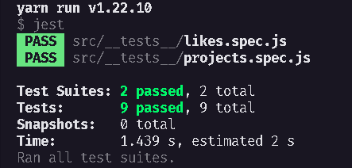

<h1 align="center">
RepositoriosAPI - Desafio 03 Concluído
</h1>

## 💫 Sobre o desafio
Nesse desafio, temos uma aplicação Node.js que está em processo de desenvolvimento mas que já possui os testes necessários para fazer toda a validação dos requisitos (você não deve mexer nos testes).
Após algumas alterações no código da aplicação, parte dos testes deixaram de passar e agora só você pode resolver esse problema.

## ✅ Testes

## 🚀 Tecnologias 

---